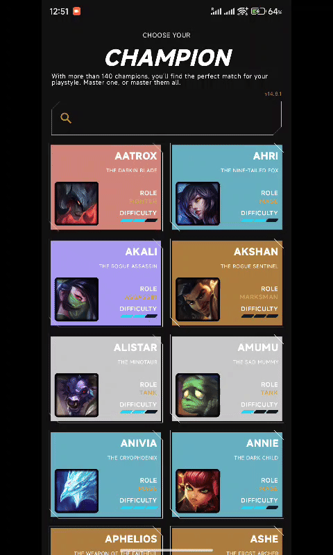

# Champions 
A league of legend champions data viewer app build with Kotlin and Jetpack Compose 

 * [Kotlin](https://kotlinlang.org/)
 * [Modern Architecture](https://developer.android.com/topic/architecture#recommended-app-arch) 
    * [Jetpack Compose](https://developer.android.com/jetpack/compose) declarative UI framework
    * [ViewModel](https://developer.android.com/topic/libraries/architecture/viewmodel) as state holder.
    * Domain layer for business logic
    * [Coroutines](https://kotlinlang.org/docs/reference/coroutines-overview.html) and [Flow](https://developer.android.com/kotlin/flow) for async operations
    * [Hilt](https://developer.android.com/training/dependency-injection/hilt-android) for dependency injection
* Other tech and tools
    * [Material3](https://m3.material.io/) and [Champions page](https://www.leagueoflegends.com/en-us/champions/) for design reference and inspiration
    * [Retrofit](https://square.github.io/retrofit/) for networking
    * [Preferences DataStore](https://developer.android.com/topic/libraries/architecture/datastore#preferences-datastore) and [Room](https://developer.android.com/training/data-storage/room) for app data storage
    * [coil](https://github.com/coil-kt/coil) for image loading
* Tests
    * [CI Workflow](https://github.com/addpaperwing/Champion/actions/runs/8862155768) 
    * [Mockk](https://mockk.io/) for test mocking
    * [Roborazzi](https://github.com/takahirom/roborazzi) for screenshot test
* TODO
    * [Proto DataStore](https://developer.android.com/topic/libraries/architecture/datastore#proto-datastore)
    * Setting screen for different version and language
    * End to end test
    * releasing and workflow for releasing
    

[APK download](https://github.com/addpaperwing/Champion/releases/tag/release)